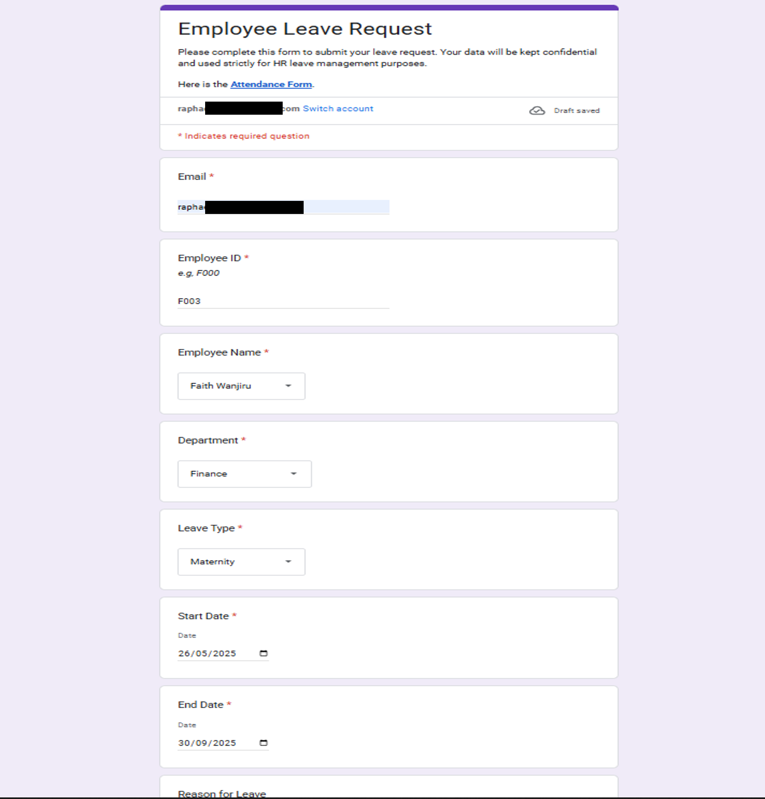
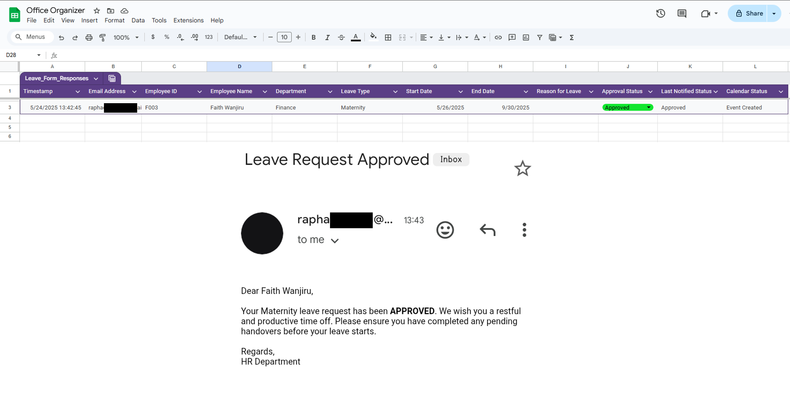
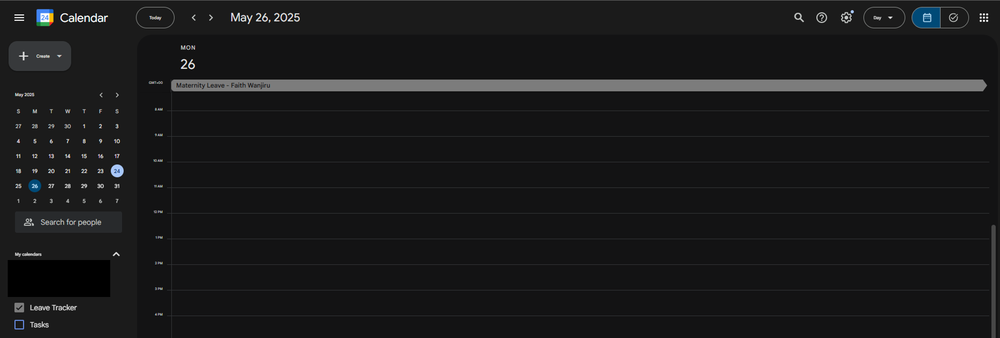

#  Leave & Attendance Management System with Email Automation and Calendar Sync

A smart, automated system using **Google Forms**, **Google Sheets**, and **Google Apps Script** to manage leave requests and attendance. This project also automates email feedback and integrates approved leaves with **Google Calendar**.

---

##  Features

- 📝 Online Leave Request Form via Google Forms
- 📩 Automated Email Feedback (Approved / Rejected / Pending)
- 📅 Google Calendar Event Sync for Approved Leaves
- ✅ Admin Editable Status Columns in Sheets
- 📌 Daily Attendance Tracker
- 🔄 Time-Triggered Script Automation
- 📊 Dashboard Ready (Google Sheets Charts)

---

##  Project Files

| File/Folder | Description |
|-------------|-------------|
| `Leave_Attendance_System_User_Guide.pdf` | Full user guide for setting up the system |
| `scripts/sendLeaveFeedback.js` | Script to send leave approval/rejection emails |
| `scripts/syncLeaveCalendar.js` | Script to create calendar events for approved leaves |
| `assets/screenshots/` | Screenshots folder for documentation |

---

##  Tools Used

- [Google Forms](https://forms.google.com)
- [Google Sheets](https://sheets.google.com)
- [Google Apps Script](https://script.google.com)
- [Google Calendar](https://calendar.google.com)

---

##  Setup Instructions

### 1. Clone or Download This Repository
```bash
git clone https://github.com/RaphaelItotia/Office_Digital_Organizer.git
```
### 2. Create the Google Form for Leave Requests
Refer to the steps in the User Guide PDF or:

- Fields: Name, Email, Leave Type, Start/End Date, Reason

- Enable: Collect Email Addresses

- Link form to Google Sheets

### 3. Paste Script into Apps Script
- Open your linked Google Sheet

- Click Extensions > Apps Script

- Paste contents from [sendLeaveFeedback.js](Scripts/sendLeaveFeedback.js) and [syncLeaveCalendar.js](Scripts/syncLeaveCalendar.js)

- Save and authorize permissions

### 4. Set Triggers
- Go to Apps Script > Triggers

- Add triggers for both scripts:

- sendLeaveFeedback → Time-driven (e.g., hourly)

- syncLeaveCalendar → Time-driven (e.g., every 2 hours)

### 5. Test with Sample Data
- Submit a test form

- Update the Approval Status column

- Watch the email & calendar automation in action

##  Screenshots

<table style="width: 100%;">
  <tr>
    <td style="text-align: center; vertical-align: top;">
      <p style="margin: 0;"><b>Leave Request Form</b></p>
    </td>
    <td style="text-align: center; vertical-align: top;">
      <p style="margin: 0;"><b>Approval Email</b></p>
    </td>
    <td style="text-align: center; vertical-align: top;">
      <p style="margin: 0;"><b>Calendar Event</b></p>
    </td>
  </tr>
  <tr>
    <td style="text-align: center;">
      
    </td>
    <td style="text-align: center;">
      
    </td>
    <td style="text-align: center;">
      
    </td>
  </tr>
</table>


##  Documentation
Download the Full [User Guide PDF](Assets/Leave_Attendance_System_User_Guide.pdf)

##  Author
Raphael Itotia

Automating business workflows using Google Apps Script, Forms, and low-code tools.

##  Contributions
Feel free to fork, star, or contribute:

- Add new features

- Improve the UI/UX of the forms

- Add Slack/Email thread integrations
